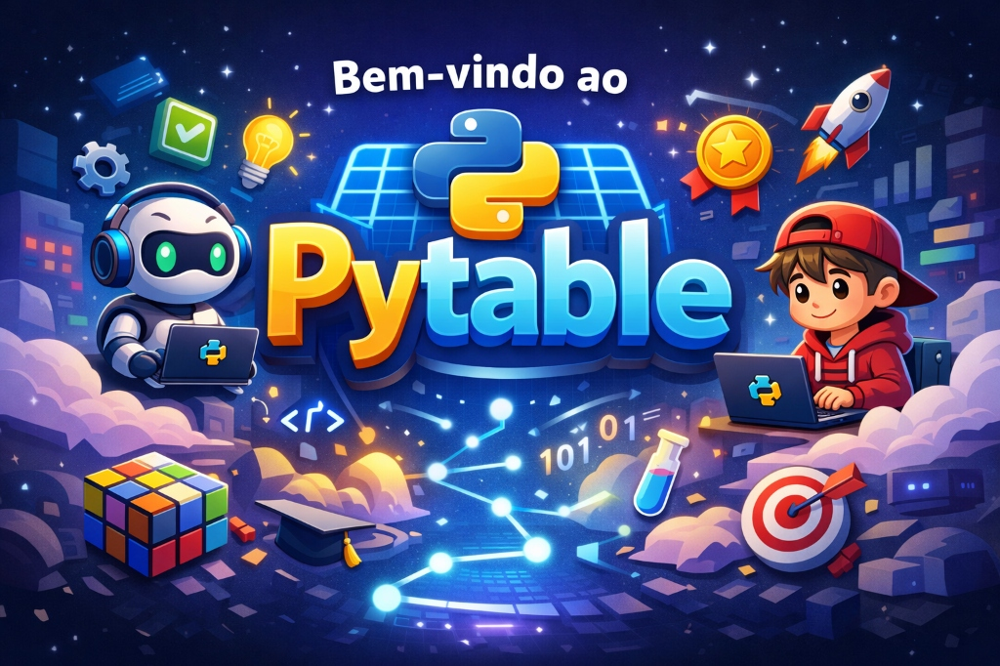

# Pytable

Aproveite ao máximo esta plataforma! Um projeto open source, desenvolvido com o apoio de IA, criado para evoluir de forma colaborativa. Sinta-se à vontade para contribuir e trazer novas melhorias.

[Pytable](https://pytable.onrender.com/login)

##  O Que Você Encontra Aqui?

O PyTable foi desenvolvido para auxiliar pessoas que têm dificuldade em desenvolver o raciocínio lógico, bem como aquelas que desejam aprimorá-lo. A proposta é oferecer uma experiência mais intuitiva, prática e divertida, tornando o aprendizado mais acessível e envolvente.

### 1. 🔀 Multiplicação & Divisão

- **Modo Multiplicação (✖️)**
- **Modo Divisão (➗)**
*Você pode alternar entre os modos a qualquer momento no menu inicial.*

### 2.  Modos de Jogo
Temos desafios para todos os níveis:
- **Treino Livre**: Escolha uma tabuada específica (ex: do 7) e pratique sem pressão.
- **Relógio (Time Attack) ⏱️**: Você tem 60 segundos. Quantas consegue acertar? O som do relógio acelera no final para testar seus nervos!
- **Modo Zumbi 🧟**: O teste final de sobrevivência. Se errar uma questão ou o tempo acabar, você perde vida. 

### 3. Inteligência de Dados
- **Dashboard Pessoal**: Acompanhe sua evolução com gráficos precisos.
- **Heatmap de Erros**: Um mapa de calor que mostra *exatamente* onde você falha (ex: células vermelhas indicam contas difíceis para você).
- **Ranking Global**: Dispute o topo da tabela com outros estudantes.
- **Ranking Global**: Conquiste níveis e badges exclusivos no ranking!

### 4.  Modo Professor & Turmas
Uma ferramenta para sala de aula:
- **Gestão de Turmas**: Professores podem criar turmas e gerar códigos de acesso únicos para seus alunos.
- **Aprovação Segura**: O professor tem controle total para aprovar ou remover alunos da turma.
- **Tarefas de Casa**: Crie atividades personalizadas (ex: "Tabuada do 2 ao 5") com data de entrega definida.
- **Vizualização de tarefas**: O professor pode vizualizar os alunos que entregaram as tarefas, editar as tarefas, e excluir as tarefas que desejar.

**Limente de 3 turmas por professor** 

---

## 📱 Como Usar no Celular (Instalação PWA)

O site foi desenvolvido como um **PWA (Progressive Web App)**. Isso significa que você pode instalá-lo no seu celular sem precisar da loja de aplicativos.

1.  Acesse o site pelo **Google Chrome** (Android) ou **Safari** (iPhone).
2.  Toque no menu de opções (três pontinhos ou ícone de compartilhar).
3.  Selecione a opção **"Adicionar à Tela Inicial"**.
4.  Confirme a instalação.
5.  **Pronto!** O Pytable agora roda em tela cheia como um app nativo.

---

## Resumo Técnico (Stack)

- **Linguagem & Backend**: Python 3.13 rodando Flask. Escolhido pela estabilidade e facilidade de manutenção.
- **Banco de Dados Inteligente**:
    - **Desenvolvimento Local**: SQLite (implementamos um sistema de *Auto-Migração* que detecta e corrige mudanças no banco automaticamente).
    - **Produção (Cloud)**: PostgreSQL hospedado no **Supabase**. 
- **Frontend**:
    - HTML5 Semântico + CSS3 
    - **Vanilla JavaScript**
- **Infraestrutura & Deploy**: Hospedado no **Render.com** com integração contínua (CI/CD).
- **Áudio Procedural**: Web Audio API. Todos os sons (acertos, erros, alarmes, zumbis) são sintetizados em tempo real pelo navegador, economizando dados e garantindo latência zero.

---

##  Créditos

**Concepção, Arquitetura e Modelagem de Dados:**

Miguel Lopes

🔗 [Linkedin](https://www.linkedin.com/in/miguel-lopes-ab8a97268/) 

**Desenvolvimento Técnico (AI Powered):**
* 🛠️ Google Antigravity 
* 🤖 Claude Opus
* 🤖 Gemini 3 Pro

---

